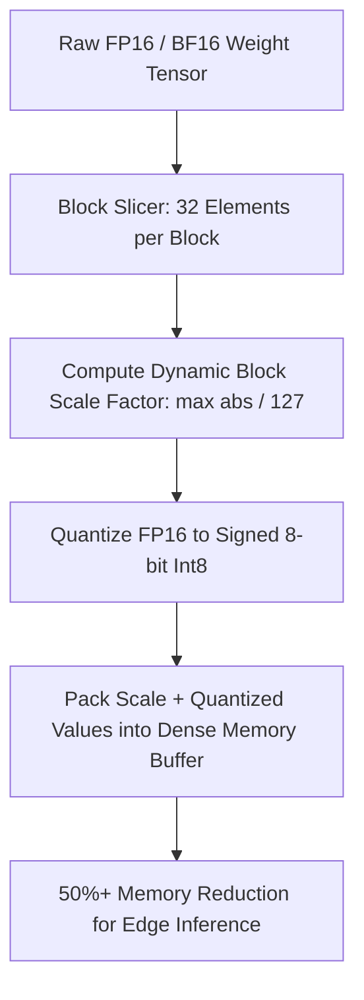

# GenPark AI Agent Skill - Weight Quantization K-Quants Block Packer

Quantizes full-precision neural network weights into compact, cache-friendly block representations (Q8_0, Q4_0) with dynamic scale factors.

Verified by [GenPark AI](https://genpark.ai) and compatible with [Model Context Protocol (MCP)](https://genpark.ai/mcp).

## Architecture Diagram

## Features
- **Deterministic Min-Max Scaling**: Preserves activation fidelity while halving memory footprint.
- **Zero External Dependencies**: Pure Python 3.9+ standard library.
